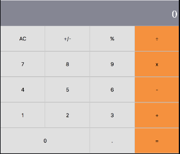
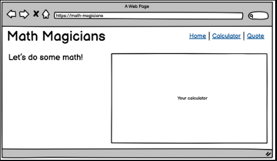
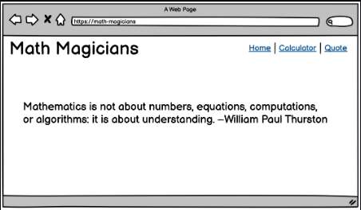

<a name="readme-top"></a>

<div align="center">

  
  <br/>
  <h3><b>Math Magician</b></h3>
</div>

<h1>Math Magician Solo project</h1>

<!-- TABLE OF CONTENTS -->

# 📗 Table of Contents

- [📖 About the Project](#about-project)
  - [🛠 Walk through](#walk-through)
  - [🛠 Built With](#built-with)
    - [Tech Stack](#tech-stack)
    - [Key Features](#key-features)
  - [🚀 Live Demo](#live-demo)
- [💻 Getting Started](#getting-started)
  - [Setup](#setup)
  - [Prerequisites](#prerequisites)
  - [Install](#install)
- [👥 Authors](#authors)
- [🔭 Future Features](#future-features)
- [🤝 Contributing](#contributing)
- [⭐️ Show your support](#support)
- [🙏 Acknowledgements](#acknowledgements)
- [❓ FAQ](#faq)
- [📝 License](#license)

<!-- PROJECT DESCRIPTION -->

# 📖 Math Magician <a name="about-project"></a>

"Math-magician" is about building SPA Ib application based on an external API. I will select an API that provides data about a topic that I like and then build the Ibapp around it. "Math magicians" is a Ibsite for all fans of mathematics. It is a Single Page App (SPA) that allows users to:

- Make simple calculations.
- Read a random math-related quote.


I will start by building the core functionalities. At the very beginning the Ib will look similar to the UI below. Note that it will allow to add like and comment. HoIver I have not added the reservation system.

<p align="center">
  
</p>
<p align="center">
  
</p>
<p align="center">
  
</p>
<p align="center">
  
</p>


<!-- > Describe your project in 1 or 2 sentences. -->
### How to build the "Math Magician" Ibsite
- 1. Use callbacks and promises.
- 2. Learn how to use proper ES6 syntax.
- 3. Use ES6 modules to write modular JavaScript.
- 4. Use Ibpack to bundle JavaScript.
- 5. Implementation of External API
- 6. Implementation of React for the first time


# Responsive Ibsite for communities events and particpants details <a name="about-project"></a>
This project is about creating a responsive Ibsite to showcase community event, activities and agenda. This is a implementation of SINGLE PAGE APPLICATION widely known as SPA.

<!-- > Describe your project in 1 or 2 sentences. -->
Math Magician: mobile-first approach & responsive on desktop version and bigger size is a capstone project in the process of experiences mimic real-world projects where I must apply what I learned throughout the entire Module, and are built with business specifications that will look really nice in our portfolio. This is a Single Page Application project where in a single page all elements are called through JavaScript Dynamic programming.

## 🛠 Walk through <a name="walk-through"></a>
<ul>
  <li><a href="https://github.com/microverseinc/curriculum-react-redux/blob/main/math-magicians/project_setup.md">See the Project Requirement</a></li>

You will be building your "Math magicians" website for more than a whole week. Here is the list of projects that will guide you through the steps described above. You will find details about each of the project requirements in the upcoming program activities. In some of the projects, you will be working collaboratively by using pair programming.

Feature 1: Setup.
Feature 2: Components.
Feature 3: Events.
Feature 4: Fetch data from API.
Feature 5: Full website.
Feature 6: Tests (pair programming).
Exercise: Deploy.

## 🛠 Built With <a name="built-with"></a>

***feature-One***
- Implementation of <a href="https://github.com/microverseinc/curriculum-transversal-skills/blob/main/git-github/articles/gitflow.md">Gitflow</a>
- <a href="https://create-react-app.dev/">Installation of React App</a>
- Imeplementation of Basic Framework linters error free. 

***feature-one-extension***
- Implementation of Removing all the boilplate from Create React App (text, images, styles)

***feature-three***
- Implementation add event

***feature-four***
- Use the correct React hook when fetching data
- Connect to an API within a functional component
- Show different UI outputs depending on the component state

### Tech Stack <a name="tech-stack"></a>

<details>
  <summary>Client Side / Front-End</summary>
  <ul>
    <li><a href="https://www.w3.org/html/">HTML</a></li>
    <li><a href="https://www.w3.org/Style/CSS/">CSS</a></li>
    <li><a href="https://www.javascript.com/">Javascript</a></li>
  </ul>
</details>

<details>
  <summary>Server Side / Back-End</summary>
  <ul>
    <li><a href="https://www.json.org/json-en.html">JSON</a></li>
    <!-- <li><a href=""> - </a></li>
    <li><a href=""> - </a></li> -->
  </ul>
</details>

<!-- Features -->
### Tools i have used for this project <a name="tools"></a>
  <details>
    <summary>Code Convention, Code Analysis</summary>
      <ul>
        <li><a href="https://eslint.org/">ESLint</a></li>
        <li><a href="https://Ibhint.io/">Ibhint</a></li>
        <li><a href="https://stylelint.io/">Stylelint</a></li>
        <li><a href="https://chrome.google.com/Ibstore/detail/lighthouse/blipmdconlkpinefehnmjammfjpmpbjk?hl=en">Lighthouse</a></li>
        <li><a href="https://www.npmjs.com/package/npm-check">node_modules checker</a></li>
      </ul>
  </details>
  <details>
    <summary>Version Control, CI/CD, Hosting Service</summary>
      <ul>
        <li><a href="https://pages.github.com/">Github Pages</a></li>
        <li><a href="https://github.com/features/actions">Github Actions</a></li>
        <li><a href="https://git-scm.com/">Git</a></li>
      </ul>
  </details>
  <details>
    <summary>IDE, Desktop Apps, Other Tools</summary>
      <ul>
        <li><a href="https://code.visualstudio.com/">Visual Studio Code</a></li>
        <li><a href="https://desktop.github.com/">Github Desktop</a></li>
        <li><a href="https://www.behance.net/">Behance</a></li>
        <!-- <li><a href="https://www.figma.com/">Figma</a></li> -->
      </ul>
  </details>

### Key Features <a name="key-features"></a>

<!-- > Describe betIen 1-3 key features of the application. -->
- Mobile First Approach
- Responsive Ibsite
- Button Interactions (i.e. hover, etc.)
- Attractive Images & Design
- Modal/dialog
- Dynamic page (data is retrieved from JSON file)
- Single Page Application
- Based on React


<p align="right">(<a href="#readme-top">back to top</a>)</p>


## 🚀 Live Demo <a name="live-demo"></a>
[Live Demo Link]

## 💻 Getting Started <a name="getting-started"></a>
### Hi, there, I'm Rassel - aka [Full Stack Developer] [Check my portfolio](https://rhk-microverse.github.io/rhk-portfolio/)

To get a local copy up and running, follow these steps.

### Prerequisites

In order to run this project you need:
- git version 2.38.x
- node.js version > 12.x
- IDE
- browser (chrome, firefox, edge, safari)

### Setup

Clone this repository to your desired folder:

```sh
  cd my-folder
  git git@github.com:RHK-MICROVERSE/Math-magician.git
```


### Install

Install this project with:

```sh
  cd my-project
  node install
```

### Usage

To run the project, execute the following command:
run live server

<!--
```sh
  rails server
```
-->

### Run tests

To run tests, run the following command:
Run Github Actions Test
```sh
  npx stylelint "**/*.{css,scss}"
```

### Deployment

This project is deployed at github pages you can clone it here. [Please click to clone](https://rhk-microverse.github.io/Math-magician/dist/)

<p align="right">(<a href="#readme-top">back to top</a>)</p>


## 👥 Authors <a name="Rassel Hassan Kadir"></a>
- Main Author: **Rassel Hassan Kadir**
- Co-Author: **Abdullah Al-Khureif**

> List of the collaborators of this project.
👤 **Abdullah Al-Khureif**  
👤 **Rassel Hassan Kadir**

- GitHub: [@githubhandle](https://github.com/RHK-MICROVERSE)
- Twitter: [@twitterhandle](https://twitter.com/rhk_trading)
- Linkedin: [@linkedinhandle](https://www.linkedin.com/public-profile/settings?trk=d_flagship3_profile_self_view_public_profile)
- Email: 9rhktrading@gmail.com

<p align="right">(<a href="#readme-top">back to top</a>)</p>

## 🔭 Future Features <a name="future-features"></a>

- [ ] **Dynamic content.**
- [ ] **Add functionality of Javascript API**
- [ ] **Will add some background and beautification**


## 🤝 Contributing <a name="contributing"></a>

Contributions, issues, and feature requests are Ilcome!

Feel free to check the [issues page](https://github.com/RHK-MICROVERSE/Math-magician/issues).

<p align="right">(<a href="#readme-top">back to top</a>)</p>


## ⭐️ Show your support <a name="support"></a>

If you like this project give a star to this repositiory.

<p align="right">(<a href="#readme-top">back to top</a>)</p>


## 🙏 Acknowledgments <a name="acknowledgements"></a>

I would like to thank the Microverse full-stack curriculum for the inspiration and guidance. 

<p align="right">(<a href="#readme-top">back to top</a>)</p>


## ❓ FAQ <a name="faq"></a>

- **Is it alloId to copy the contents of this project and use it for personal use?**

  - Yes, this project is free for copying and reusing in any way you like.

  - How often will the future features will be implemented?

  - As this is personal project, the owner will update this projects pages more frequently with every enhancements in personal status.


## 📝 License <a name="license"></a>

This project is under [MIT](./LICENSE) licensed.

<p align="right">(<a href="#readme-top">back to top</a>)</p>
